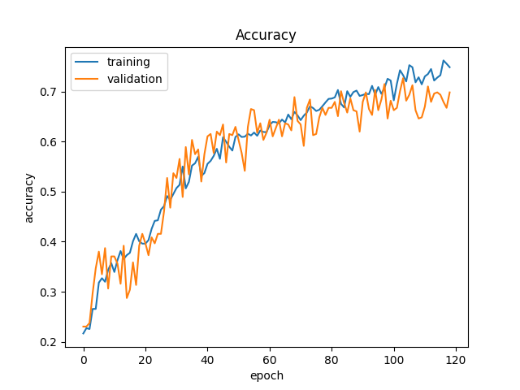
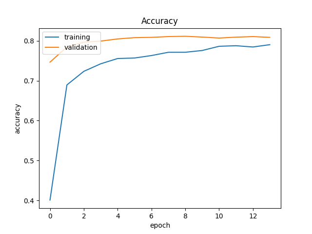

# Dogs Detector

## Description

This project is a simple application to detect dogs breeds. It was created for my undergraduate course - "Artificial Intelligence". The main goal was to create a simple CNN model which can detect a few dogs breeds.

# Dataset

To complete this task I selected **The Stanford Dogs** dataset. It contains 120 breeds with about 150 images per breed.


# Data augmentation

As the result of a little number of images per breed, it was reasonable to use data augmentation technique.

To apply it I've implemented below Image generator.

```
 datagen = ImageDataGenerator(
            rescale=1. / 255,
            shear_range=0.05,
            rotation_range=10,
            zoom_range=0.25,
            horizontal_flip=True,
            validation_split=0.2,
            width_shift_range=0.2,
            height_shift_range=0.2)
```


# Simple model
I've created my model by trial and error method. You can check all of my previous models in [Dogs models creator](https://github.com/Sladamos/DogsDetector/blob/main/models/creators/DogsModelsCreator.py). 

It was created to detect one of 5 breeds:

- Labrador
- Doberman
- Spaniel
- Irish terrier
- Bernese mountain dog



```
def model_11(self, input_shape):
        model = TensorNeuralModel()
        layers_creator = self.layers_creator
        model.add_layer(layers_creator.create_gaussian_noise(0.004))
        model.add_layer(layers_creator.create_convolution_layer(32, 3, 'relu', input_shape=input_shape))
        model.add_layer(layers_creator.create_pool_layer((2, 2)))
        model.add_layer(layers_creator.create_dropout_layer(0.25))

        model.add_layer(layers_creator.create_gaussian_noise(0.004))
        model.add_layer(layers_creator.create_convolution_layer(64, 3, 'relu', input_shape=input_shape))
        model.add_layer(layers_creator.create_pool_layer((2, 2)))
        model.add_layer(layers_creator.create_dropout_layer(0.25))

        model.add_layer(layers_creator.create_gaussian_noise(0.004))
        model.add_layer(layers_creator.create_convolution_layer(128, 3, 'relu', input_shape=input_shape))
        model.add_layer(layers_creator.create_pool_layer((2, 2)))
        model.add_layer(layers_creator.create_dropout_layer(0.25))

        model.add_layer(layers_creator.create_gaussian_noise(0.004))
        model.add_layer(layers_creator.create_convolution_layer(256, 3, 'relu', input_shape=input_shape))
        model.add_layer(layers_creator.create_pool_layer((2, 2)))
        model.add_layer(layers_creator.create_dropout_layer(0.25))

        model.add_layer(layers_creator.create_flatten_layer(input_shape=input_shape))
        model.add_layer(layers_creator.create_dense_layer(1024, activation='relu'))
        model.add_layer(layers_creator.create_dropout_layer(0.5))
        model.add_layer(layers_creator.create_dense_layer(256, activation='relu'))
        model.add_layer(layers_creator.create_dropout_layer(0.5))
        model.add_layer(layers_creator.create_dense_layer(128, activation='relu'))
        model.add_layer(layers_creator.create_dropout_layer(0.5))
        model.add_layer(layers_creator.create_dense_layer(self.number_of_breeds, activation='softmax'))
        return model
```
# Advanced model

As the result of a little number of images per breed, it was also reasonable to use transfered learning technique and advanced model is based on it. It is extension of **InceptionV3** model.

It was created to detect one of all dataset breeds.



```
def adv_model_2(self, input_shape):
        base_model = InceptionV3(weights='imagenet', include_top=False, input_shape=input_shape)
        model = TensorNeuralModel(base_model)
        model.add_layer(self.layers_creator.create_global_average_pooling())
        model.add_layer(self.layers_creator.create_dropout_layer(0.2))
        model.add_layer(self.layers_creator.create_dense_layer(self.number_of_breeds, activation='softmax'))
        model.disableLayer(0)
        return model
```
